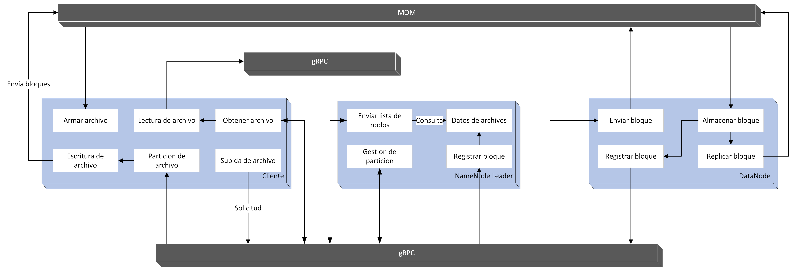

# **ST0263 Tópicos Especiales en Telemática**

# **Estudiantes**: Daniel Melguizo Roldan, dmelguizor@eafit.edu.co  Holmer Ortega Gomez, hortegag@eafit.edu.co

# **Profesor**: Juan Carlos Montoya Mendoza, jcmontoy@eafit.edu.co

*******

**Tabla de Contenido**
1. [Introducción](#introduccion)
2. [Requisitos completados y no completados](#requisitos)
3. [Diseño y arquitectura](#arquitectura)
4. [Ambiente de desarrollo](#ambiente)
5. [Ejecución](#ejecucion)

*******

<div id="introduccion" />
  
### **Proyecto 1**
El proyecto consiste en diseñar un sistema de archivos distribuido, que permita compartir y descargar de manera concurrente cualquier tipo de archivo que se encuentre almacenado en un conjunto de nodos gestionados por un servidor principal. El servidor principal lo conoceremos con NameNode, y el conjunto de nodos sobre el cual se almacenaran los distintos archivos subidos en el sistema se conoceran como DataNodes. Ademas, la red de DataNodes se comportara a su vez como una red P2P.

*******

<div id="requisitos" />

### ***Requisitos completados***
* El sistema debe permitir al usuario subir un archivo.
* El sistema debe permitir al usuario descargar un archivo.
* El almacenamiento de archivos en el sistema se debe realizar por bloques.
* El sistema debe tener un registro de los distintos archivos subidos en el sistema.
* El cliente debe utilizar sus propios recursos para particionar el archivo que desea subir.
* Los DataNodes deben garantizar una replicacion de los bloques que reciben.
* El sistema debe permitir al usuario obtener una lista de los archivos disponibles en el sistema.
* El sistema debe implementar MOM como middleware para la transferencia de archivos.
* El sistema debe implementar gRPC como middleware para ejecutar las distintas funciones del sistema.

### ***Requisitos no completados***
* El NameNode Leader debe tener un NameNode Follower a manera de respaldo.

*******

<div id="arquitectura" />

### ***Arquitectura***



*******

<div id="ambiente" />
  
### ***3. Descripción del ambiente de desarrollo y técnico***
Este proyecto fue desarrollado en Python y se utilizaron las siguientes librerias para el desarrollo del mismo, todas las que son necesarias instalar vienen para ser instaladas dentro del archivo texto requirements.txt:

* **threading , re , socket , random , json , configparser , os, sys**
* **grpc version >= 1.62.0**
* **grpcio-tools version >= 1.62.0**
* **pika version >= 1.3.2**

Se tienen tres carpetas principales, Server (NameNode), DataNode, Cliente, las explicaremos en orden para entender un poco el funcionamiento de lo desarrollado.

1. La carpeta Server, en este caso, el NameNode, es el encargado de gestionar las conexiones de los DataNode y de proporcionar la diferente informacion que el usuario solicite a la aplicacion. Se genera un archivo data.json en el cual se va guardando la informacion contenida en el servidor, como por ejemplo, que archivos estan en el sistema, el tamaño de cada archivo, en cuantos bloques esta dividido dicho archivo y los nodos que tienen cada uno de los bloques en los que esta dividido. El server levanta un servicio gRPC a traves del cual respondera las distintas solicitudes realizadas por el usuario, y inicia un servidor que espera las conexiones de los distintos DataNodes.

2. La carpeta DataNode, los DataNodes se conectan al servidor solicitando un peer al cual conectarse, si es el unico DataNode disponible, es registrado por el servidor para que cuando otro DataNode ingrese, se conecte al ya existente, esta diseñado de tal manera para que se forme una especie de cadena entre los DataNodes, donde el ultimo DataNode que llegue, se conecta al primero y al penultimo, se explica un poco mejor en la imagen a continuacion.


Los DataNodes levantan a su vez tambien dos servicios, MOM y gRPC, el servicio de MOM sera utilizado principalmente para todo el tema de transferencia de archivos, por este servicio recibe los bloques enviados por el usuario y envia los bloques en caso tal un usuario los solicite, el servicio de gRPC es utilizado principlamente para que el usuario pueda comunicarse con el DataNode para solicitarle el envio de los diferentes bloques. Adicionalmente, levantan un servidor, en este caso por sockets, el cual sera utilizado exclusivamente para informarle al servidor que me uni a la red o para conectarse a otro DataNode, esto se realiza para agregar en cada DataNode una lista de peers conocidos.

3. La carpeta Cliente, el cliente se comunica para realizar cualquiera de las funcionalidades del sistema, subir un archivo, descargar un archivo o listar los archivos disponibles en el sistema. El usuario tambien inicializa los servicios MOM y gRPC, de igual manera para llamar tanto funciones en el sistema como recibir y enviar archivos.


Se definieron los siguientes puertos para el uso de cada uno de los middlewares:
* **8000** utilizado para sockets.
* **8001** utilizado para gRPC.
* **5672** utilizado para MOM.

*******

<div id="ejecucion" />
  
#### ***4. Descripción de como configurar y como ejecutar el proyecto***

Para ejecutar el código es necesario crear mínimo tres instancias en AWS, esto para cada una de las interfaces, Cliente, DataNode, Server. Para un buen funcionamiento seguir por favor las siguientes instrucciones:

Crear dos (la cantidad deseada) instancias de EC2 con OS Ubuntu 20.04, recomendable usar el mismo grupo de seguridad para las instancias creadas para no configurar cada una manualmente. Una vez la instancia este creada, ir a los grupos de seguridad y editar las reglas de entrada, vamos a habilitar los siguientes puertos, cada uno de tipo TCP y permitiendo origen desde 0.0.0.0/0:
  * 8000
  * 8001
  * 5672

En mi caso, la conexión a las instancias lo hago con la aplicación PuTTY, pueden usar cualquiera que deseen que les permita interactuar con la instancia. Vamos a ejecutar los siguientes comandos:

```ssh
sudo apt-get update
sudo apt-get upgrade
sudo apt-get install python3
sudo apt-get install python3-pip
sudo apt install docker.io
sudo docker run -d --hostname my-rabbit -p 15672:15672 -p 5672:5672 --name rabbit-server rabbitmq:3-management
sudo git clone https://github.com/DannyMelguizo/Telematica-P2P.git
cd Telematica-P2P/Peer/
sudo python3 -m grpc_tools.protoc -I protobufs --python_out=. --pyi_out=. --grpc_python_out=. protobufs/service.proto
sudo python3 -m pip install -r requirements.txt
```

Una vez llegados a este punto, ya es posible ejecutar el proyecto usando el comando:

```ssh
sudo python3 main.py
```

Pero no existiría mucha interacción entre los peers, ya que ninguno tiene archivos para compartir dentro de la red, vamos a hacer una simulación, para ello, tomaremos una de las instancias de AWS como peer de arranque, las otras, serán peers que interactúen con el sistema, vamos a crear una carpeta llamada "shared_files" en la cual crearemos o almacenaremos los archivos que serán compartidos dentro de la red. Para efectos de la simulación podemos crear el mismo archivo en varios peers o diferentes para buscar varios archivos, utilizando el siguiente comando en las instancias que definimos como peers (aclarar que el servidor de arranque también se comporta como peer, solo que por lo general este no debería contener archivos).

```ssh
sudo mkdir shared_files
sudo nano file.txt
```

Cabe mencionar que este directorio se generara por defecto una vez ejecutado el main.py, pero se generara vacío, podemos crear tantos archivos como queramos dentro de esta ruta y serán compartidos dentro de la red.

Una vez hecho esto ahora si podemos ejecutar el archivo main.py con el comando especificado anteriormente, el primero que ejecutaremos será la instancia que definimos como servidor de arranque, cuando el programa nos solicite la IP del servidor de arranque, colocaremos lo siguiente incluyendo la mayúscula.

```ssh
Enter the IP of the Bootstrap Server:
Bootsp
```

Esto le especificara al sistema que somos un servidor de arranque y que atenderemos a los nuevos peers, una vez hecho esto, podemos ejecutar las demás instancias y esta vez, cuando solicite la IP colocaremos la IP del servidor de arranque proporcionada por AWS.

Se nos mostrara una interfaz como la siguiente.

```ssh
Select a number to navigate through the menu.
1. Search for a file
2. List all connections

0. Exit
```

Si introducimos el número 1, nos permite realizar una petición por un archivo, en la cual deberemos especificar el nombre del archivo, teniendo en cuenta que el sistema es case sensitive. Si el sistema no ha encontrado o no encuentra el archivo se nos mostrara un mensaje como el siguiente:

```ssh
Looking for the file...

If the file is found, we will show you a list below.

Press any key to go back to the menu.
```
En el cual podemos apretar cualquier tecla para realizar otra búsqueda, teniendo en cuenta que una vez se encuentre, nos llega una lista con los peers que tienen el archivo y el nombre del archivo para reconocer que búsqueda se realizó.

La otra opción que tiene la interfaz, en este caso el número 2, es para listar las conexiones que ese peer tiene, estas conexiones son a las que él le preguntara por el archivo y confía en que cada conexión le preguntara a su vez a las conexiones que ellos tengan.

Por último, si introducimos la opción 0 abandonaremos la red, pero antes de abandonarla el peer notifica a sus conexiones que saldrá de la red, por lo tanto, se tienen que reestructurar.

